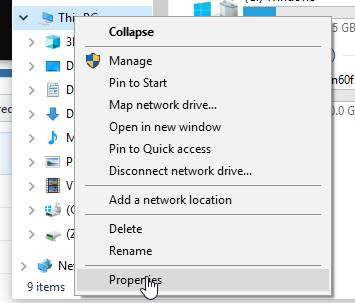
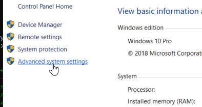
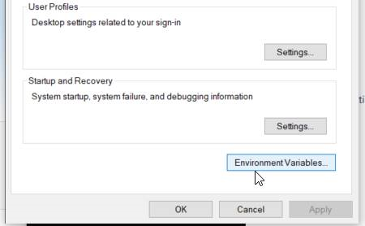
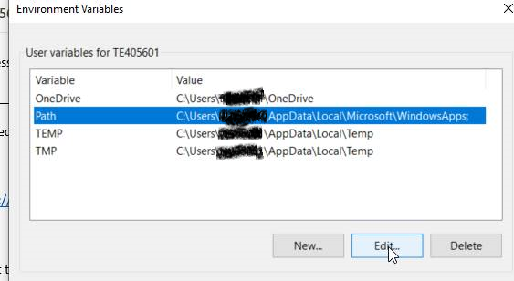
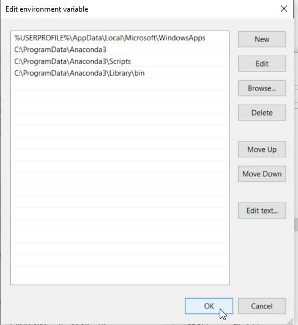
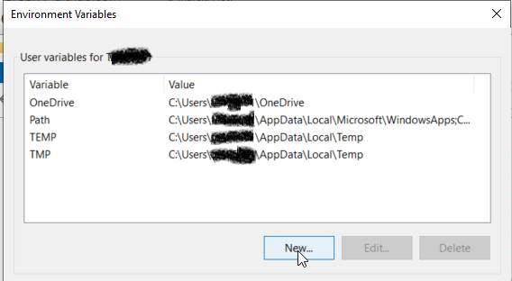
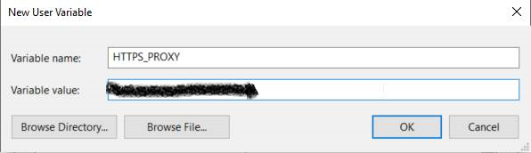

How to install
--------------------

[install anaconda]

Add anaconda paths to environment variables
~~~~~~~~~~~~~~~~~~~~

Go to system properties

Go to Advanced system settings

Go to Environment Variables

Click on Path and edit it

Find `python.exe` file in your PC

Copy the directory and add it to paths. You should also add `\\Scripts` and `\\Library\\bin`
folders. So for example if the directory of `python.exe` is  

-   `C:\\ProgramData\\Anaconda3` 

then you should add this path and also

-   `C:\\ProgramData\\Anaconda3\\Scripts`
-   `C:\\ProgramData\\Anaconda3\\Library\\bin`

Add https proxy to environment variables
~~~~~~~~~~~~~~~~~~~~

Create a new environment variable

Put the name 'HTTPS_PROXY' and the proxy string in value

[install grizly]

